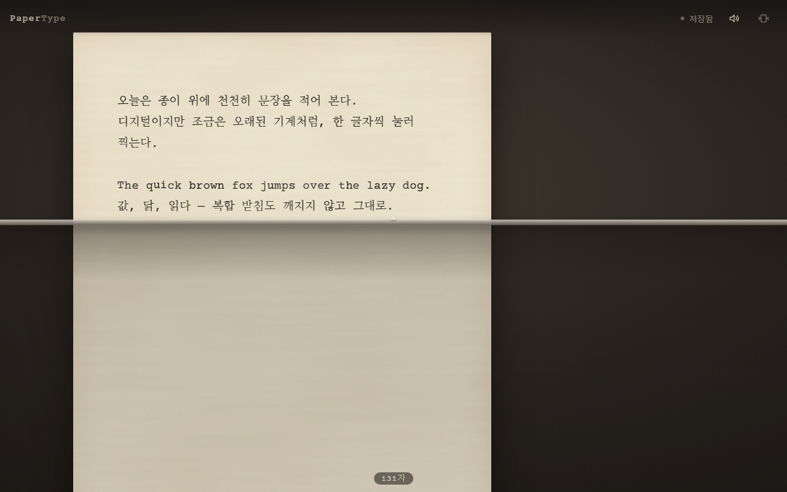
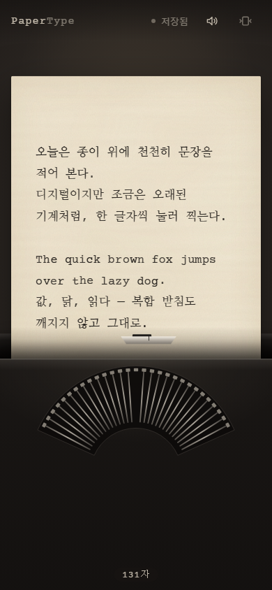

<div align="center">

# ⌨️ PaperType

**한 글자씩 종이에 찍히는 감각을 되살린, 로컬 우선 디지털 타자기**

[](https://github.com/jeiel85/paper-type/actions/workflows/ci.yml)
[](https://jeiel85.github.io/paper-type/)


[](LICENSE)

### [▶ 브라우저에서 바로 타이핑해 보기](https://jeiel85.github.io/paper-type/)

설치도 가입도 필요 없어요. 글은 이 브라우저 안에만 저장됩니다.

<sub>🇺🇸 A local-first digital typewriter for the web. Korean IME composition is a first-class requirement: a fixed strike point with a moving sheet, deterministic imperfect ink, synthesized key sounds and crash-safe autosave — no accounts, no tracking.</sub>

</div>

---

<table>
  <tr>
    <td width="68%"></td>
    <td width="32%"></td>
  </tr>
  <tr>
    <td align="center"><sub><b>데스크톱</b> · 캐럿이 가운데를 넘으면 종이가 밀려납니다</sub></td>
    <td align="center"><sub><b>모바일</b> · 좁은 화면에선 가독성을 지킵니다</sub></td>
  </tr>
</table>

## ✨ 무엇이 다른가요

PaperType의 가치는 메모 기능의 양이 아니라 **타이핑하는 순간의 질감**입니다. 아무 할 말이 없어도 열어서 몇 글자 찍어 보고 싶어지는 앱을 목표로 합니다.

| | 특징 | 설명 |
| :-: | --- | --- |
| 🇰🇷 | **한글 조합이 1급** | 키 입력으로 글자를 만들지 않고 브라우저 IME에 맡깁니다. 조합 중인 글자는 밑줄로만 보여 주고 저장하지 않으며, 한 음절은 undo 한 번에 되돌아갑니다. 자모 단위로 쪼개지는 일이 없습니다. |
| 📍 | **고정된 타점, 움직이는 종이** | 지금 쓰는 줄은 항상 화면의 같은 높이에 있고 종이가 위로 올라갑니다. 캐럿이 가운데를 넘으면 종이가 왼쪽으로 밀리고, Enter를 치면 캐리지가 돌아옵니다. 줄 끝 근처에서는 벨이 한 번 울립니다. |
| 🖋️ | **완벽하지 않은, 그러나 결정적인 잉크** | 글자마다 농도와 위치가 미세하게 다르지만, 같은 글은 언제 다시 열어도 똑같이 찍혀 있습니다. 한글은 획이 복잡해 흔들림을 더 작게 줍니다. |
| 🔊 | **코드로 만든 타자 소리** | 녹음 파일 없이 Web Audio로 키·스페이스·백스페이스·캐리지 리턴·벨 소리를 합성합니다. 같은 소리가 세 번 연속 나지 않습니다. |
| 💾 | **잃어버리지 않는 저장** | IndexedDB 자동 저장(0.5초 debounce, 최대 2초)에 더해, 저장 전에 탭을 닫거나 저장이 실패하면 비상 스냅샷으로 다음에 열 때 복구합니다. |
| 🔒 | **계정 없음, 추적 없음** | 서버도 분석 SDK도 없습니다. 글은 이 기기 브라우저 밖으로 나가지 않으며, 디버그 로그에도 본문을 남기지 않습니다. |
| ♿ | **움직임·소리 줄이기** | 시스템의 "동작 줄이기" 설정을 따르고, 앱에서도 소리와 움직임을 따로 끌 수 있습니다. 스크린 리더는 `본문` 편집 영역을 읽습니다. |

## 🧪 지금 단계: P0 타이핑 프로토타입

전체 앱보다 **한 장의 종이에서 입력 감각**을 먼저 검증하는 단계입니다. 통과 기준은 [Gate P0](docs/08_QA_PERFORMANCE_ACCESSIBILITY.md) 8개 항목입니다.

| Gate P0 | 상태 | 확인 방법 |
| --- | :-: | --- |
| 한글/영문 입력, 조합 중 Backspace, 선택 영역 교체 | 🟡 | E2E(Chromium CDP 조합 시뮬레이션) 통과 · Galaxy Tab 실기기 Chrome + Samsung 키보드로 복합 받침·조합 중 Backspace 확인 · Windows 한글 IME, Gboard, Samsung Internet 수동 확인 남음 |
| 붙여넣기·삭제·undo/redo (조합 1개 = undo 1번) | ✅ | 단위 + E2E |
| 타점 고정, 종이 이동 | ✅ | E2E |
| 결정적 잉크 (`fixtures/ink-seed-v1.json`) | ✅ | 독립 Python 참조 구현과 비트 단위 일치 |
| 즉시 반응하는 소리, 소리 없이도 정상 입력 | ✅ | E2E · 첫 입력 지연을 없애려 오디오를 유휴 시간에 미리 준비 |
| 55fps 이상, 반복되는 long task 없음 | ✅ | 3천·1만 자 문서에서 평균 58~60fps, long task 0 (`PERF=1`) |
| 새로고침·탭 닫기 후 복구 | ✅ | E2E |
| reduced motion / sound off | ✅ | E2E |

다음 단계(Phase 1 Web MVP)에서는 노트 목록과 월별 묶음, 휴지통, 종이·잉크 프리셋 3종, 나이트 램프, TXT/MD/JSON 내보내기와 백업 ZIP, PWA 오프라인을 다룹니다. 전체 로드맵은 [docs/09](docs/09_ROADMAP_BACKLOG.md)에 있습니다.

## 🧭 설계 문서

구현보다 설계를 먼저 굳혔습니다. 결정의 근거는 모두 문서와 ADR에 남아 있습니다. → **[docs/README.md](docs/README.md)**

- [제품 정의](docs/00_PRODUCT_BRIEF.md) · [레퍼런스와 차별화](docs/01_REFERENCE_AND_DIFFERENTIATION.md) · [UX/UI](docs/02_UX_UI_SPEC.md)
- [웹 구조](docs/03_WEB_ARCHITECTURE.md) · [입력/IME 엔진](docs/04_INPUT_IME_ENGINE.md) · [렌더링·소리·햅틱](docs/05_RENDER_AUDIO_HAPTIC.md)
- [데이터·백업](docs/06_DATA_BACKUP_EXPORT.md) · [Android 네이티브](docs/07_ANDROID_NATIVE.md) · [QA·성능·접근성](docs/08_QA_PERFORMANCE_ACCESSIBILITY.md)
- [위험과 결정(ADR)](docs/10_RISKS_AND_DECISIONS.md) · 데이터 계약: [`schemas/`](schemas) · [`fixtures/`](fixtures)

<details>
<summary><b>어떻게 동작하나요? (입력 구조)</b></summary>

```text
투명한 native <textarea>   ← 입력·조합·선택은 브라우저가 처리 (IME 정확성)
        │ beforeinput / input / composition*
        ▼
Document Engine            ← 이전 값과 diff → replace 연산 1개, 앱이 undo 기록 소유
        │
        ├─ Autosave → IndexedDB (+ localStorage 비상 스냅샷)
        ▼
Ink overlay (aria-hidden)  ← 같은 글을 문단 단위로 다시 그림, 글자마다 seed 잉크
        │
Carriage                   ← 캐럿 위치를 재서 종이를 transform으로 이동
```

- 캔버스만으로 그리는 편집기는 쓰지 않습니다. 한글 조합과 접근성이 깨지기 때문입니다([R1](docs/10_RISKS_AND_DECISIONS.md)).
- textarea와 잉크 층은 줄바꿈이 1px도 다르면 안 되므로 커닝·합자를 끄고, 글자 흔들림은 `transform`이 아닌 inline `left/top`으로만 줍니다([04 §11.1](docs/04_INPUT_IME_ENGINE.md)).
- 잉크 seed는 `FNV-1a(v1:{inkSeed}:{문단}:{문단 내 위치}:{code point})` → `mulberry32`입니다. Android도 같은 test vector를 통과해야 합니다([05 §2](docs/05_RENDER_AUDIO_HAPTIC.md)).

</details>

## 🛠️ 개발

```bash
npm install
npm run dev          # http://localhost:5173
npm test             # 단위 테스트 (Vitest)
npm run e2e          # E2E (Playwright, 처음 한 번 `npx playwright install chromium`)
npm run build        # dist/ 정적 빌드 — 어떤 정적 호스팅에도 올릴 수 있어요
```

- `?debug=1`을 붙이면 fps·입력 지연·long task HUD와 IME 이벤트 로그(본문 제외)가 켜집니다.
- 성능 측정: `PERF=1 npx playwright test perf` · README 스크린샷 갱신: `SHOTS=1 npx playwright test screenshots`
- 잉크 seed 알고리즘을 바꾸면 `npm run fixture:ink`로 test vector를 다시 만들고 `seedAlgorithmVersion`을 올립니다. CI는 Python 참조 구현과 fixture가 어긋나면 실패합니다.

**스택** React 19 · TypeScript · Vite · Dexie(IndexedDB) · Web Audio · Ajv(JSON Schema) · Vitest · Playwright

## 📄 라이선스

코드는 [MIT](LICENSE)입니다. 번들된 글꼴(Courier Prime, 나눔명조)은 SIL OFL 1.1이며, 사용 자산 목록은 [SOURCES.md](SOURCES.md)에 있습니다.

PaperType은 iPhone 앱 Platen의 공개된 기능 설명에서 아이디어를 얻었지만, 브랜드·그래픽·UI·소리는 복제하지 않고 독자적으로 설계했습니다([01](docs/01_REFERENCE_AND_DIFFERENTIATION.md), [R9](docs/10_RISKS_AND_DECISIONS.md)).
